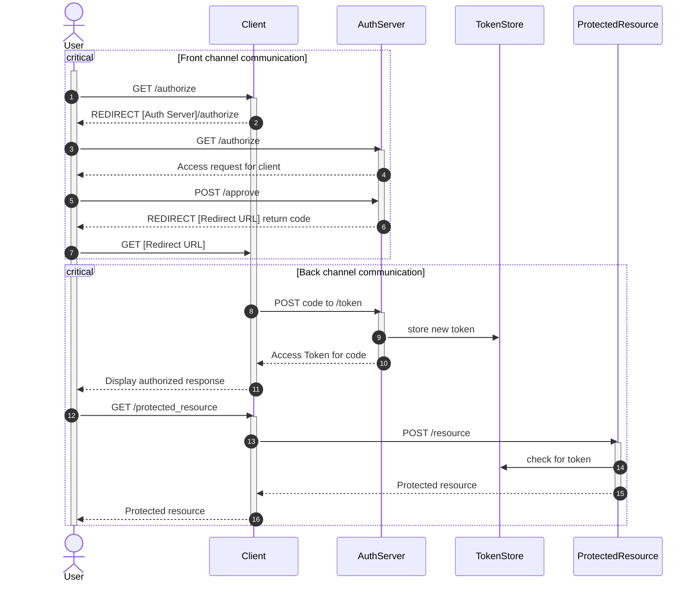

# Authorization Code Grant Type



### Sequence of events
#### Front channel communication
1. The *user* makes a GET request to the *client* initiating the process of granting permission to the protected resource
2. The *client* redirects to the *auth server* with the following detail
   ```
   HTTP 302 Found
   Location: [AuthServer]/authorize?client_id=client-1&response_type=code&state=aflkjwer789d
   ```
   - The `client_id` must be one previously registered with the *auth server*
   - The `state` is a randomly generated string to prevent request forgery
3. The *user* follows redirect URL with query params
4. The *auth server* then displays an access request page to the *user*
5. The *user* approves the request which includes a request id that is used server side to access the original query params 
6. The *auth sever* redirects to the *client*'s callback URL with the following detail
   ```
   HTTP 302 Found
   Location: [Client]/redirectPath?code=asdfklj82&state=aflkjwer789d
   ```
   - The `code` is generated and saved against the og request, this will be used later
   - The `state` should be the same as in the og params
7. The user follows the redirect URL with query params
#### Back channel communication
8. The *client* sends a post request to the *auth server* to get a token
    ```
    POST [Auth Server]/token
    Host: [Client]
    Content-type: application/x-www-form-encoded
    Authorization: Basic [base64encode(clientId:clientSecret)]

    grant_type=authorization_code
    &redirect_uri=[Client]/redirectPath
    &code=asdfklj82
    ```
    - The `code` is going to be swapped for the token
    - The `grant_type` tells the *auth server* what authentication method should be used
    - For `redirect_uri` currently unknown, see page 49
    - The `Authorization` header includes previously registered credentials that are known by the *auth server*
9. The new token is stored in a database accessible by both the *auth service* and the *protected resource* alongside the corresponding `client_id`
10. The *auth server* then responds back to the *client* with an **access token**
    ```
    HTTP 200 OK
    Response Body: {
        "access_token": "ksdfjh76723",
        "token_type": "Bearer"
    }
    ```
11. The *client* will then display an authorized message to the user once the token has been recieved
12. The *user* makes a call to the *client* that requires it to access the *protected resource*
13. The *client* sends a post request to the *protected resource* 
    ```
    POST [ProtectedResource]/resource
    Host: [Client]
    Content-type: application/x-www-form-encoded
    Authorization: Bearer [access_token]
    ```
    - This is a post request to conform to the OAuth 2 standard which allows the Bearer token to be sent as a header, in the request body, or as a query param
14. The *protected resource* checks the *token store* for the token (this may be different with JWT's)
15. The *protected resource* responds after successful authorization
16. The *client* responds to the *user* with the resource